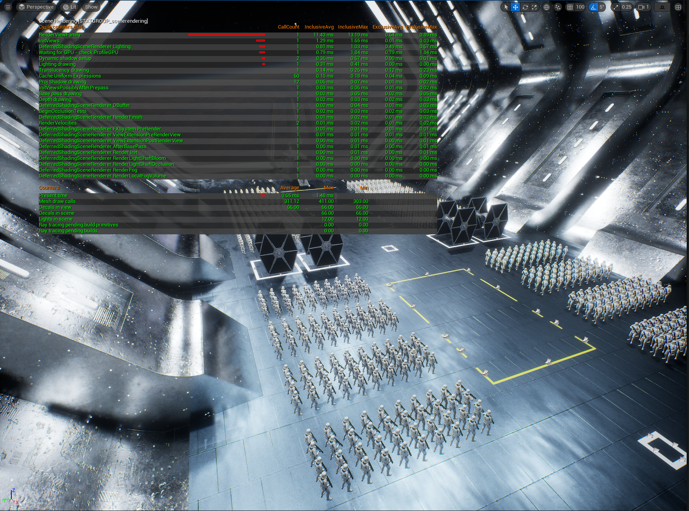

# Daily Progress Log — 2026-06-07

**Week:** Month 1, Week 3
**Focus:** stat scenerendering — Scene Rendering Analysis on Starship Hangar Scene

---

## Overview

Today's session focused on running `stat scenerendering` on the same Starship hangar scene used on 2026-06-02 (177 actors, 10+ RectLights, Software Ray Tracing). The goal was to capture and understand scene-level rendering counters as a complement to the `stat unit` and GPU Visualizer data collected earlier this week.

---

## Setup

- Same project and scene as 2026-06-02
- Lumen with Hardware Ray Tracing active
- Command used: `stat scenerendering` via viewport console ( ` )

---

## Results — stat scenerendering Counters

| Metric | Average | Max | Min |
|---|---|---|---|
| **Mesh draw calls** | 311 | 411 | — |
| **Decals in view** | 66 | 66 | 66 |
| **Decals in scene** | 66 | 66 | 66 |
| **Lights in scene** | 12 | 12 | 12 |
| **Ray tracing pending build primitives** | 0 | 0 | 0 |

---

## Screenshot

---

## Analysis

### Mesh draw calls: 311 avg / 411 max
Draw calls at 311 average is **moderate-high**. The max spike to 411 occurs when the camera captures more actors simultaneously. This is the primary area of interest for future optimization work.

Key observation: draw call count scales with camera frustum — more actors visible = more draw calls. This confirms the scene is **draw call bound** from the environment and prop meshes.

### Decals in view: 66
All 66 decals in the scene are visible from this camera angle. This is a non-trivial contribution to the render cost and worth auditing in a future session — checking whether all 66 are necessary and visible, or whether some can be culled.

### Lights in scene: 12
Consistent with the 10+ RectLights documented on 2026-06-02. No surprises here.

### Ray tracing pending build primitives: 0
BVH (Bounding Volume Hierarchy) structure is fully built — no meshes are queued for RT processing. Scene is in a stable state.

---

## Cycle Counters — Notable Entries

| Pass | Call Count | Inclusive Avg |
|---|---|---|
| RenderViewFamily | 1 | 11.43 ms |
| ProShadow drawing | 12 | 0.70 ms |
| Base pass drawing | 1 | 0.02 ms |
| Lighting drawing | 1 | 0.31 ms |
| Translucency drawing | 1 | 0.14 ms |

**RenderViewFamily at 11.43 ms** is the total CPU-to-GPU submission cost for the frame — expected as the top-level container for all passes below it.

**Base pass drawing at 0.02 ms** is notably light, confirming that raw geometry submission is efficient. The frame cost is not coming from geometry complexity.

**ProShadow drawing at 0.70 ms across 12 calls** — one shadow pass per light, cost is acceptable for this light count.

---

## Key Insight

Combining today's `stat scenerendering` data with the findings from 2026-06-02:

- GPU bottleneck identified on 2026-06-02 via `stat unit` → confirmed today: **draw calls 311 avg** are the primary scene-level rendering load
- Internal Lumen pass cost is low (base pass 0.02 ms) → the overhead comes from the number of draw calls, not geometry complexity per mesh
- 66 decals fully in view is a secondary cost worth investigating in a future optimization session

---

## Tomorrow's Plan

- "YouTube: 'export Blender to UE5 '

---

*Hardware: RTX 5060 Ti 16GB | Engine: Unreal Engine 5 | Scene: BDS Tutorial Starship*
