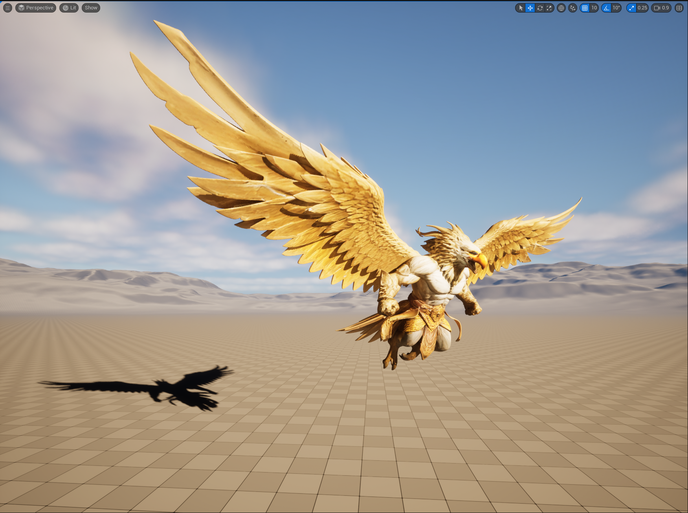

# Daily Progress Log — 2026-06-08

**Date:** June 08, 2026
**Phase:** Phase 1 — Foundation | Month 1 — Week 4 — Monday
**Reference:** How to Import FBX from Blender to Unreal Engine 5
**Engine:** Unreal Engine 5.4

---

## Overview

Today I studied the most fundamental aspect of the **Asset Integration Pipeline** — one of the core pillars of a Technical Artist's (TA) competency. The primary responsibility of a TA is not to create 3D models from scratch, but to ensure those models can enter a game engine correctly, efficiently, and without errors.

For today's exercise, I sourced a free model from [Sketchfab](https://sketchfab.com), imported it into Blender, and then exported it into Unreal Engine 5. Several configuration steps were required along the way.

---

## Understanding UV Unwrap Quality on Sketchfab

Most models on Sketchfab already come with a built-in UV unwrap, as Sketchfab requires UV mapping so that textures and image materials can display correctly on their platform. However, the quality of that UV unwrap varies depending on the creator.

### Paid vs. Free Models

| Type | UV Unwrap Quality |
|---|---|
| **Paid (Store)** | Near 100% professional — passes Sketchfab's strict curation process |
| **Free** | Usually present, but may be messy, auto-generated, or overly dense (especially photogrammetry or beginner models) |

### Types of UV Unwraps Found on Sketchfab

- **Manual / Clean UV** — Textures are neatly arranged according to the model's anatomy. Ideal for re-texturing in Blender or Substance Painter.
- **Automatic / Packed UV** — Textures are fragmented randomly by the computer. The model looks fine out-of-the-box but is very difficult to edit or repaint manually.

### How to Verify Before Downloading

Use Sketchfab's **Model Inspector** feature:
1. Click the **Model Inspector** button (stacked layers icon at the bottom-right of the 3D preview, or press `I`).
2. In the left-side menu, look for the **Maps** section.
3. If options like *Base Color*, *Normal*, or *Roughness* are active and clickable, the model has UV unwrapping because it uses image textures.
4. You can also switch to **UV Check** mode to visually inspect the UV layout.

> For this session, I downloaded a free `.glb` file and imported it directly into Blender.

---

## Steps in Blender

### 1. Apply Transforms

- Click on the model in the Viewport.
- Press `Ctrl + A` → Select **All Transforms**.
- This resets the object's scale to `1.0` and positions it at the world origin `(0, 0, 0)`.
- **Check facing direction:** The model should face the **negative Y-axis (-Y)** in Blender, since UE5 uses the **positive X-axis** as its forward direction.

### 2. Handling Multi-Part Objects

If a model consists of multiple separate meshes (e.g., wings, body, armor, feathers), exporting them as-is can result in disorganized data or dozens of separate files in UE5. There are two approaches:

**Option 1: Merge into a Single Object (Recommended)**

Best for static meshes or objects driven by a single skeleton:
1. Hold `Shift` and click each part to select them all.
2. Make sure the main body object is selected last (highlighted in bright yellow).
3. Press `Ctrl + J` to join all parts into one mesh.
4. All materials and textures are preserved after merging.

**Option 2: Export as Separate Parts (Intentionally)**

Best when individual parts need to be toggled or swapped via code in UE5 (e.g., detachable armor):
- Select all parts, then go to **File > Export > FBX (.fbx)**.
- Ensure **Selected Objects** is checked.
- Apply the same export settings as below.

> **For this session, I used Option 1 (single mesh).**

### 3. FBX Export Settings

1. Select the merged mesh object.
2. Go to **File > Export > FBX (.fbx)**.
3. Configure the following settings:

| Setting | Value |
|---|---|
| **Path Mode** | `Copy` (activate the box icon next to it to embed textures) |
| **Limit to** | `Selected Objects` ✅ |
| **Smoothing** | `Face` |
| **Bake Animation** | Disabled (no animation on this model) |

4. Optionally save these settings as a preset (e.g., `"Unreal Export"`) by pressing the `+` button.
5. Set the destination path, name the file, and click **Export FBX**.

---

## Steps in Unreal Engine 5

1. Open your UE5 project.
2. Create a new folder in the **Content Browser** (e.g., `Elang_Model`).
3. **Drag and drop** the exported `.fbx` file into that folder.
4. The **FBX Import Options** dialog will appear. Configure:

| Section | Setting |
|---|---|
| **Mesh** | `Static Mesh` (no skeleton/animation) |
| **Material Import Method** | `Create New Materials` |
| **Import Textures** | ✅ Enabled |

5. Click **Import All**.

---

## Screenshot

---

## Key Learnings

By working through this pipeline, I encountered and solved real technical problems that TAs face in the industry:

- **Data Optimization (`Ctrl + J` — Joining Meshes):** Learned how to handle assets composed of many separate parts so their data structure is clean and readable by a game engine.

- **Data Validation (`Ctrl + A` — Apply Transforms):** Understood the importance of normalizing coordinate metrics (Scale and Rotation) between a DCC application (Blender) and a real-time engine (UE5) to prevent geometry corruption.

- **Material & Texture Pipeline (Embed Textures / PBR Shading):** Successfully configured the export path for PBR (Physically Based Rendering) material data — from Blender's node system all the way to auto-generated material assets in Unreal Engine.

---

## Open Question / Insight

**FBX Interoperability Limitations — A Key TA Awareness Point**

Although all assets were automatically converted into UE5 material assets, the FBX format has known interoperability limitations. FBX can only translate basic node structures (e.g., an image texture plugged directly into a base color input).

If an artist builds complex node logic in Blender — such as blending two colors using a *Mix Color* node, applying mathematical operations, or using procedural textures — **Unreal Engine cannot read this automatically.** This is precisely where a Technical Artist's role becomes critical: manually reconstructing that color math logic inside UE5's **Material Graph** so the result visually matches the original Blender setup.

Since I am still in the Foundation phase, I have not explored this further yet. I will revisit this when I reach the material/texture pipeline phase or when I encounter a real error related to this process.

---

## Next Progress

- [ ] Download textures from [ambientcg.com](https://ambientcg.com) → Build first PBR material in UE5
