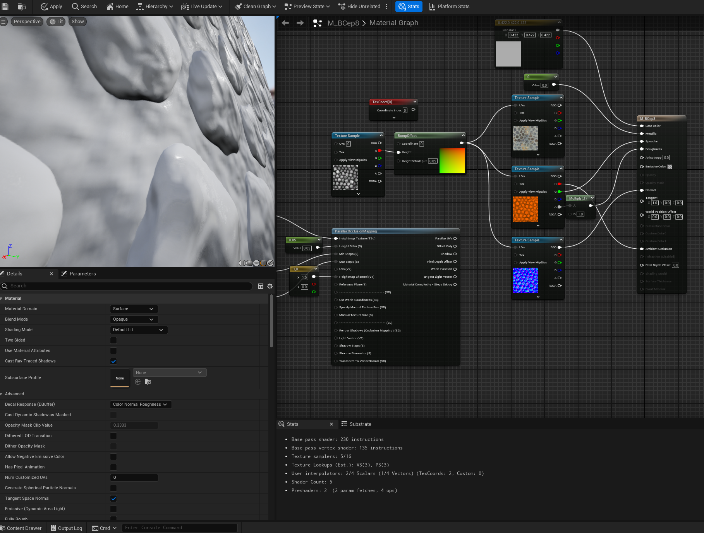
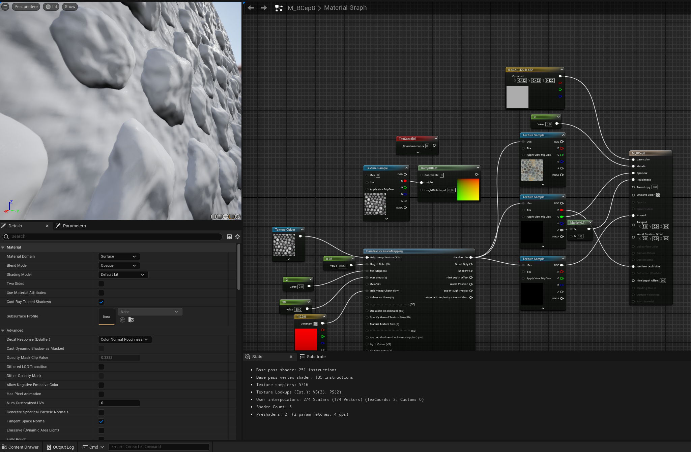

# Daily Log — 2026-06-10

**Phase:** 1 | **Month:** 1 | **Week:** 4 | **Day:** Wednesday
**Topic:** Bump Offset Mapping & Parallax Occlusion Mapping (POM) — UE4 Materials 101, Episode 8 (Ben Cloward)
**Engine:** Unreal Engine 5.4

---

## 📖 Theory: Depth Illusion Hierarchy in Materials

Before this episode, the primary technique for simulating surface depth was the **Normal Map** — which fakes lighting by redirecting surface normals, but produces no actual parallax shift when the camera moves.

Episode 8 introduces two advanced techniques that both take a **Height Map** as their input and go a step further by actually shifting what the camera perceives.

**What is a Height Map?**
A grayscale texture where:
- **White** = high / raised surface
- **Black** = low / recessed surface

Height maps do not need to be high resolution. The example in the video uses only **256×256**. A slightly blurry height map actually produces smoother, more natural-looking results — sharp edges cause visible artifacts.

---

## 📦 Technique 1: Bump Offset Mapping

**Core idea:** Shift the UV coordinates of subsequent texture samples based on the camera's view angle. As the viewing angle changes, the UVs offset — creating the illusion that the surface has depth.

**Key node:** `BumpOffset`
- Input: `Height` (from Height Map texture) + `HeightRatioInput` (controls depth intensity)
- Output: Offset UV coordinates → feed into the UV input of all downstream TextureSample nodes

**Strengths:**
- Extremely cheap — adds only a handful of shader instructions
- Sufficient for most surfaces viewed from a typical distance
- Safe choice for low-spec platforms and background assets

**Weaknesses:**
- Depth illusion collapses at **glancing angles** — the surface appears flat
- No self-shadowing between surface features

---

## 📦 Technique 2: Parallax Occlusion Mapping (POM)

**Core idea:** Instead of simply offsetting UVs, POM performs **ray marching** directly inside the material shader. It traces rays from the camera into the Height Map to compute where the "real" surface would be — producing accurate depth at any viewing angle.

**Key node:** `ParallaxOcclusionMapping`
- Input: Height Map + `HeightRatio` (recommended: **0.02–0.05** for stone/brick) + `Min Steps` + `Max Steps`
- Output: Parallax UV coordinates → feed into UV input of TextureSample nodes

**Strengths:**
- Highly realistic — depth is preserved even at very steep glancing angles
- Produces **self-shadowing** between raised surface features
- A convincing 3D appearance without adding geometry

**Weaknesses:**
- Significantly more expensive than Bump Offset — repeatedly samples the texture for each ray step
- **Silhouette edges break** — POM cannot alter the actual mesh outline, so edges look incorrect up close
- Higher `HeightRatio` requires higher `Max Steps` to avoid *pancake layering* artifacts

---

## 🗺️ Concept Map: Choosing the Right Height Ratio

For brick or stone materials, **0.02–0.05** is the most physically grounded range.

**The math:**
- In reality, mortar sits roughly 1–2 cm below the brick face
- If one texture tile covers a 2×2 m surface area: `ratio = 2 cm ÷ 200 cm = 0.01`
- Raising it slightly to 0.02–0.05 compensates for the limitations of the optical illusion at screen resolution

**Risks when value exceeds 0.1:**

| Artifact | Description |
|---|---|
| Pancake layers | Surface appears stacked like layers unless Max Steps is pushed very high |
| Texture swimming | Mortar lines appear to shift and slide as the camera moves |
| Pixel stretching | Brick side faces stretch and blur noticeably |

---

## ✅ What I Did Today

### 1. Setting Up the Node Graph

```
// Bump Offset
TexCoord[0] ──→ BumpOffset ──→ UV (Texture Sample: Albedo)
                    ↑
              Height Map Texture (256x256)
              HeightRatio: 0.05

// Parallax Occlusion Mapping
TexCoord[0] ──→ ParallaxOcclusionMapping ──→ Parallax UVs ──→ UV (Texture Sample)
                    ↑
              Height Map Texture
              Height Ratio: 0.05
              Min Steps: 8
              Max Steps: 32
```

### 2. Viewport Comparison — Two Planes Side by Side

Built two planes with identical textures — one using Bump Offset, one using POM — and tested both at multiple camera angles directly in the UE5.4 viewport.

| | Bump Offset | POM |
|---|---|---|
| Normal viewing angle | Good | Good |
| Glancing angle | **Flat — depth collapses** | **Detail preserved** |
| Self-shadowing | None | Yes |
| Performance cost | Low | High |
| Silhouette edge | Clean | Glitches at mesh boundary |

### 3. Compiled Shader Stats

- Base pass instructions: ~230–251
- Texture samplers used: 5 / 16
- Shader count: 4–5

Result: **medium range** — appropriate for a combined POM + Bump Offset material.

---

## 📸 Screenshot

| Bump Offset | POM |
|---|---|
|  |  |
| Flat at glancing angles — depth collapses | Detail preserved at glancing angles |
| No self-occlusion between features | Self-occlusion present — more realistic |

---

## 🎯 TA Skills Practiced Today

| Skill | Relevance as a Technical Artist |
|---|---|
| Bump Offset node setup | Lightweight depth illusion for background and tiled surfaces |
| POM node setup (Min/Max Steps) | High-quality depth for hero assets — requires tuning for performance |
| Height Ratio calibration | Grounding shader parameters in real-world physical scale |
| Glancing angle testing | Standard QA check for any material that uses depth techniques |
| Shader instruction count reading | Core TA skill — knowing when a material is too expensive for its use case |
| Viewport A/B comparison | Systematic technique evaluation methodology |

---

## 📝 Technical Artist Notes for UE5.4

**Bump Offset vs. POM — Decision Framework**
- **Bump Offset** → background props, tiled floors/walls, any surface not viewed up close. Low cost, sufficient for the majority of surfaces in a scene.
- **POM** → hero assets that receive close camera attention: main room walls, cutscene floors, surfaces that anchor the player's eye.
- **POM + Real Geometry** → when silhouette accuracy matters. POM handles surface micro-detail; actual geometry handles the visible outline. In UE5 this pairs naturally with Nanite for macro forms.

**Shader Cost Reference**

| Instruction Count | Category | Suitable For |
|---|---|---|
| < 150 | Light | Background, tiled, distant props |
| 150–300 | Medium | Mid-ground hero assets |
| > 300 | Heavy | Foreground close-ups only |

**POM and Nanite**
POM is the recommended substitute for Displacement Maps on Nanite meshes. Since Nanite does not support tessellation-based displacement, POM provides surface depth detail without altering actual geometry — no tessellation budget required.

**Min/Max Steps Tuning**
A good starting point: `Min Steps: 8, Max Steps: 32`. If pancake layering is visible at steep angles, increase Max Steps incrementally (32 → 64 → 128). Watch the instruction count — each doubling of steps adds meaningful shader cost.

---

## 💡 Insights & New Understanding

- The key difference between Bump Offset and POM is not just quality — it's the *method*. Bump Offset simply shifts UVs; POM actually simulates where the surface *would be* from the camera's perspective. Understanding this distinction makes the tradeoff obvious.
- Height Ratio is not just a visual preference — it has a physically correct range based on real-world surface proportions. Treating it as a physical measurement (not just "turn it up until it looks good") prevents common artifacts.
- POM silhouette glitching is a fundamental limitation, not a setup error. The correct response is to combine POM with real geometry for surfaces where the outline matters.
- Shader instruction count is a continuous concern, not a one-time check. A material that looks fine on a single plane may break a scene's performance budget when tiled across hundreds of surfaces.

---

## 🔧 Tools & References

- **Engine:** Unreal Engine 5.4
- **Learning Reference:** Ben Cloward — *Bump Offset and Parallax Occlusion Mapping* (UE4 Materials 101, Episode 8)

---

## 📌 Plan for Next Session

- Ben Cloward — Episode 9
