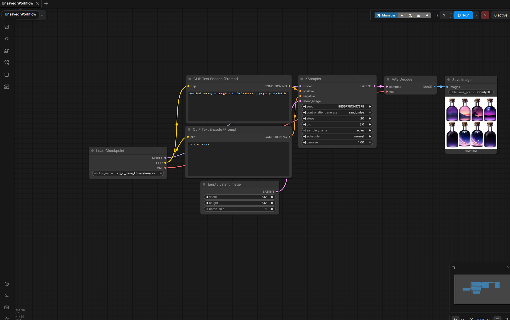

# Daily Log — 2026-06-15

**Phase:** 1 | **Month:** 2 | **Week:** 5 | **Topic:** ComfyUI Install + First AI-Assisted Asset Generation Pipeline

---

## 📖 Theory: What Is ComfyUI and Why Does a Technical Artist Use It?

ComfyUI is a node-based interface for running Stable Diffusion locally. Unlike automatic1111 or other front-ends, ComfyUI exposes the full generation pipeline as a visual graph — each step of the diffusion process is a discrete node with explicit inputs and outputs. This architecture is significant for a Technical Artist: the workflow is not a black box. It is a readable, modifiable pipeline.

**Why this matters for a Technical Artist:**

- The node graph in ComfyUI is structurally identical to a shader graph or material editor — inputs flow into processing nodes and produce an output. Reading one trains the mental model for reading the other.
- TAs working in modern studios are expected to operate AI-integrated pipelines. ComfyUI is the tool of choice for this because it is scriptable, extensible, and produces reproducible results.
- Generating reference textures and concept assets locally eliminates dependency on stock libraries and allows rapid iteration during the pre-production phase.
- Understanding the pipeline at the node level — not just clicking "generate" — is the difference between a TA who uses AI as a tool and one who integrates it into a real production workflow.

---

## 🗺️ Concept Map: ComfyUI Pipeline as a Signal Flow

The default ComfyUI workflow maps directly onto a signal processing model familiar from Electrical Engineering:

```
Load Checkpoint        →  Load the model weights ("initialize the processor")
        ↓
CLIP Text Encode (+)   →  Encode positive prompt into conditioning vector
CLIP Text Encode (-)   →  Encode negative prompt into conditioning vector
        ↓
Empty Latent Image     →  Initialize the latent canvas (noise space)
        ↓
KSampler               →  Run the diffusion denoising loop (N steps)
        ↓
VAE Decode             →  Decode latent space output → pixel space image
        ↓
Save Image             →  Write PNG to disk
```

**Positive vs. Negative Prompt — Signal Filter Analogy:**

| Node | Function | EE Analogy |
|---|---|---|
| CLIP Text Encode (Positive) | Define what the model should generate | Pass filter — allow target frequencies |
| CLIP Text Encode (Negative) | Define what the model should suppress | Notch filter — cut unwanted frequencies |

The KSampler operates between these two conditioning vectors, pushing the latent representation toward the positive signal while moving away from the negative.

---


## 🔬 SDXL vs SD 1.5 — Model Architecture Difference

The default workflow loaded from a previous session referenced `v1-5-pruned-emaonly-fp16.safetensors` (SD 1.5). The roadmap for Month 2 specifies SDXL. The distinction matters technically:

| Property | SD 1.5 | SDXL Base 1.0 |
|---|---|---|
| Parameters | ~860M | ~3.5B |
| Native resolution | 512×512 | 1024×1024 |
| CLIP encoders | 1 | 2 (dual encoder) |
| VRAM requirement | ~4GB | ~8GB+ |
| Output quality | Good for base tasks | Significantly higher detail |

SDXL uses a **dual CLIP encoder architecture** — this is why the default workflow shows two CLIP Text Encode nodes. Each encoder processes the prompt differently and their outputs are combined before reaching the KSampler. This is not positive/negative — that is a separate distinction. The two nodes in the default workflow are: one for positive conditioning, one for negative conditioning, both passing through the dual SDXL encoder system.

---

## ✅ What I Did Today

### 1. ComfyUI Environment Verification

- Located existing ComfyUI installation from a previous exploratory session (approximately one month prior)
- Launched via `python main.py` — terminal confirmed successful startup with `[ComfyUI-Manager] All startup tasks have been completed`
- Accessed the interface at `localhost:8188` — workflow canvas loaded correctly
- Identified version compatibility warning: Frontend 1.43.17 outdated, backend requires 1.43.18 or higher — dismissed, flagged for update in a future session

### 2. Model Path Configuration

**Problem:** Load Checkpoint node referenced `v1-5-pruned-emaonly-fp16.safetensors` — model not found. Root cause: models had been relocated from the default C: drive path to `D:\AI_models\models\` during the previous exploratory period.

**Solution:** Edited `extra_model_paths.yaml` in the ComfyUI root directory.

```yaml
comfyui:
    base_path: D:/AI_models/models/
    checkpoints: checkpoints/
    ...
```

- Corrected path casing (`AI_Models` → `AI_models`) to match the actual directory name on disk
- Restarted ComfyUI — model directory correctly resolved

### 3. SDXL Model Download and Integration

- Downloaded `sd_xl_base_1.0.safetensors` from Hugging Face (`stabilityai/stable-diffusion-xl-base-1.0`)
- Placed file in `D:\AI_models\models\checkpoints\`
- Selected model in Load Checkpoint node via the `◄ ►` selector — error cleared

### 4. First Successful Generation

**Prompt (Positive):**
```
beautiful scenery nature glass bottle landscape, purple galaxy bottle
```
**Prompt (Negative):**
```
text, watermark
```

- Result: 4-image batch (512×512) — stylized galaxy bottles, consistent style across batch
- Pipeline confirmed functional end-to-end

 

### 5. Node Graph Analysis — TA Reading Exercise

Analyzed the default workflow as a pipeline diagram before modifying it:

| Node | Input | Output | TA Parallel |
|---|---|---|---|
| Load Checkpoint | `.safetensors` file | MODEL, CLIP, VAE | Loading a material library |
| CLIP Text Encode | Text string + CLIP | CONDITIONING | Defining material parameters |
| Empty Latent Image | Width, Height, Batch | LATENT | Creating a blank render target |
| KSampler | MODEL, CONDITIONING ×2, LATENT | LATENT | Executing a render pass |
| VAE Decode | LATENT + VAE | IMAGE | Converting render buffer to display |
| Save Image | IMAGE | PNG file | Exporting a texture |

### 6. KSampler Parameter Exploration

Tested the effect of key KSampler parameters with controlled prompt:

| Parameter | Default | Test Values | Observed Effect |
|---|---|---|---|
| `steps` | 20 | 10 / 20 / 30 | 10 steps: faster, lower detail. 30 steps: diminishing returns beyond 20 for this sampler |
| `cfg` | 8.0 | 3 / 8 / 12 | cfg 3: loose, painterly. cfg 12: over-saturated, artifacts on edges |
| `sampler_name` | euler | — | Left at default for baseline |

### 7. Game Asset Reference Generation — TA Workflow Application

Applied ComfyUI as a **reference generation tool** for game asset pre-production. Pipeline: define asset type in prompt → generate → use as modeling/texture reference.

**Prompt structure used:**
```
game asset concept, stylized [asset type], PBR texture,
isometric view, clean background, reference sheet
```

**Negative (consistent across all tests):**
```
blurry, watermark, text, realistic, photo,
dark background, shadow, low quality
```

**Assets generated:**

| Asset | Prompt Addition | Result Quality |
|---|---|---|
| Wooden Crate | `stylized wooden crate` | High — clear wood grain, isometric angle correct, clean BG |
| Metal Barrel | `stylized metal barrel, rust details, sci-fi style` | High — 4 style variations in batch (grey, blue, orange) |
| Stone Pillar | `stylized stone pillar, ancient ruins, mossy surface` | High — moss detail visible, platform base generated |

All three outputs are usable as direct modeling reference for Blender and as visual brief material for a production art team.

---

## 🎯 TA Skills Practiced Today

| Skill | Relevance as a Technical Artist |
|---|---|
| Reading a node pipeline | Foundation for reading shader graphs, material editors, and Blueprints |
| Model path configuration via YAML | Environment setup — understanding how tools locate their asset dependencies |
| Positive/Negative prompt as filter system | Directional control of generation output — maps to parameter-driven material control |
| KSampler parameter testing | Systematic observation of output variation — same methodology as tweaking material parameters and observing result |
| Asset reference generation workflow | Practical application: AI-generated references replace manual search or stock library dependency |
| Pipeline thinking | Treating generation as a reproducible, modifiable process — not a one-click tool |

---

## 📝 Technical Artist Notes

**ComfyUI as a TA Tool — Honest Assessment**
ComfyUI is a support tool, not a core TA skill. The core remains: UE5 Material Editor, HLSL, RenderDoc, optimization methodology. ComfyUI's role in this roadmap is approximately 20% of total learning time — primarily for generating texture references and concept assets quickly. It should not consume time that belongs to shader study.

**What ComfyUI Generates vs. What a TA Needs**
SDXL outputs are 2D PNG images. They are not meshes, not normal maps, not PBR texture sets. The correct use in a TA pipeline:
- Albedo reference → starting point for texture painting or direct import as base color
- Concept reference → visual brief for modeling direction in Blender
- Heightmap source → grayscale generation for landscape or displacement input (requires specific prompting)

**SDXL Native Resolution**
SDXL is trained at 1024×1024. Running it at 512×512 (the default in the inherited workflow) produces acceptable results but below the model's native capability. For texture generation intended for UE5 import, update Empty Latent Image to 1024×1024 once VRAM budget is confirmed stable.

**Workflow Reusability**
The node graph built today is a reusable pipeline. Changing only the positive prompt text generates a new asset type without modifying any other node. This is the same principle as a parameterized material function in UE5 — the structure is fixed, the inputs are variable.

**Negative Prompt as Quality Floor**
A well-defined negative prompt acts as a minimum quality standard for every generation. The negative prompt used today (`blurry, watermark, text, realistic, photo, dark background, shadow, low quality`) is a reusable baseline for all game asset generation sessions going forward.

---

## 💡 Insights & New Understanding

- The ComfyUI node graph and the UE5 Material Editor are the same mental model applied to different domains. Understanding one accelerates understanding the other.
- Positive and negative prompts are not "describe what you want / describe what you don't want" — they are two conditioning vectors that the sampler navigates between. The model moves toward the positive conditioning and away from the negative conditioning simultaneously during each denoising step.
- Generating game asset references with ComfyUI is faster and more targeted than searching ArtStation or stock libraries. The output is also free of licensing concerns when used as a reference, not a final asset.
- The most important thing about AI tools is knowing their limits. SDXL cannot generate normal maps, roughness maps, or metallic maps with precision. Those must be authored manually or via Substance. ComfyUI generates albedo references and concept art — not a complete PBR texture set.
- The `extra_model_paths.yaml` file is the correct mechanism for pointing ComfyUI to external model directories. It is not a hack — it is the designed configuration path. Understanding this prevents the common mistake of copying large model files into multiple locations.

---

## 🔧 Tools & Environment

- **ComfyUI:** Portable install, existing from prior session
- **Model:** `sd_xl_base_1.0.safetensors` — Stability AI, via Hugging Face
- **Model path config:** `extra_model_paths.yaml` — `base_path: D:/AI_models/models/`
- **Hardware:** RTX 5060 Ti 16GB
- **Engine (parallel context):** Unreal Engine 5.4

---

## 📌 Plan for Next Session — 2026-06-16 (Tuesday)

- Generate 5 seamless PBR textures in ComfyUI: stone, wood, metal (×2 variants), fabric
  - Prompt structure: `seamless [surface] texture, PBR ready, top view, tileable`
  - Target resolution: 1024×1024 (update Empty Latent Image node)
- Import all 5 textures into UE5 as Base Color inputs
- Assign to mesh in scene — verify tiling behavior under Lumen lighting
- Establish workflow: ComfyUI → UE5 texture import → material assignment. This becomes the standard texture sourcing pipeline for all Phase 1 and Phase 2 material exercises going forward.
