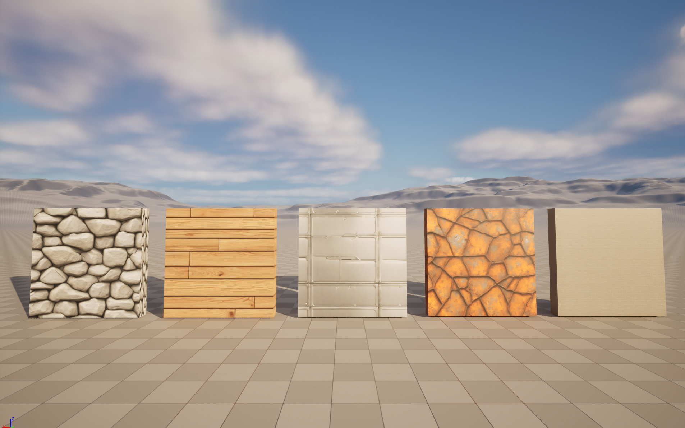

# Daily Log — 2026-06-16

**Phase:** 1 | **Month:** 2 | **Week:** 5 | **Topic:** ComfyUI Seamless Texture Generation + UE5 Albedo Import Pipeline

---

## 📖 Theory: Albedo-Only Pipeline — Scope and Rationale

Albedo (Base Color) is the foundational layer of any PBR material — it defines surface color and pattern without encoding lighting information. In a full PBR set, albedo is always authored first because it establishes the visual identity of the surface. Normal map, roughness, metallic, and AO are built on top of it.

ComfyUI (Stable Diffusion XL) is an image generator. It produces pixel data, not physics-encoded texture data. This distinction matters:

- Albedo is pure color information — SDXL can generate this reliably
- Normal maps encode surface vector directions as RGB values — these must be mathematically accurate per-pixel. SDXL cannot guarantee this; a generated image may visually resemble a normal map but its vector data will be incorrect, producing wrong lighting in engine
- Roughness maps encode linear PBR values calibrated against a BRDF shader — same limitation applies

**ComfyUI's actual role in production pipelines:**

| Use Case | Why ComfyUI Works |
|---|---|
| Albedo / Base Color generation | Output is color data — SDXL generates this correctly |
| Tileable texture concepting | Rapid iteration before Substance workflow |
| Grunge and mask generation | Grayscale data for material layers in UE5 |
| Asset reference sheets | Visual brief for modeling direction |

For normal and roughness generation from an albedo source, the correct tool is Materialize (free) or Substance Sampler — both perform physics-aware conversion rather than image synthesis.

---

## 🗺️ Concept Map: ComfyUI → UE5 Texture Pipeline

```
ComfyUI                          UE5 Content Browser
─────────────────────            ────────────────────────────
Load Checkpoint (SDXL)           Import PNG
        ↓                                ↓
CLIP Text Encode (+/-)           Texture Settings
        ↓                        - Texture Group: World
Empty Latent Image               - sRGB: enabled
1024 × 1024                      - Compression: DXT1/BC1
        ↓                                ↓
KSampler                         Material Editor
        ↓                        - Texture Sample node
VAE Decode                       - Connect → Base Color pin
        ↓                                ↓
Save Image (PNG)         →       Assign to Mesh → View in Lumen
```

---

## ✅ What I Did Today

### 1. Prompt Template Design for Seamless Textures

Established a reusable prompt structure for tileable albedo generation:

**Positive:**
```
seamless [TYPE] texture, PBR ready, top view, tileable, high detail, surface material, game ready
```

**Negative (consistent across all):**
```
blurry, watermark, text, seams, border, dirt overlay, low quality, shadows
```

Resolution: updated Empty Latent Image to **1024×1024** (SDXL native resolution)

### 2. Generated 5 Albedo Textures

| # | Surface Type | Prompt Modifier |
|---|---|---|
| 1 | Stone wall | `seamless stone wall texture, rough surface, grey` |
| 2 | Wood planks | `seamless wood planks texture, natural grain, brown` |
| 3 | Metal plate (clean) | `seamless metal plate texture, brushed steel, industrial` |
| 4 | Metal (rusty) | `seamless rusted metal texture, oxidized, orange rust` |
| 5 | Fabric | `seamless fabric texture, woven cloth, neutral color` |

### 3. UE5 Import and Material Assignment

- Imported all 5 PNGs via Content Browser → Import
- Import settings: Texture Group `World`, sRGB enabled, Compression `Default (DXT1/BC1)`
- Created one Material per texture — connected Texture Sample to Base Color pin only
- Placed 5 cube meshes in scene, one material per mesh
- Viewed result under Lumen (Sky Light + Directional Light)



---

## 🎯 TA Skills Practiced Today

| Skill | Relevance as a Technical Artist |
|---|---|
| Prompt engineering for tileable textures | Systematic control of generation output — same methodology as parameterized material inputs |
| Texture import settings in UE5 | sRGB, compression format, and texture group decisions affect memory budget and rendering accuracy |
| Seamless texture evaluation | Reading tiling quality under Lumen — identifying visible seams is a baseline QA skill |
| Understanding albedo-only visual limitations | Knowing what is missing (normal, roughness, metallic, AO) and why — builds judgment for full PBR authoring later |
| Pipeline thinking | ComfyUI → export → import → material → assign is a reproducible, documentable workflow |

---

## 📝 Technical Artist Notes

**Why Albedo First**
Full PBR texture set authoring is introduced in a later phase. The priority at this stage is establishing a reliable ComfyUI → UE5 pipeline. Albedo isolates the pipeline variable — if import, assignment, or tiling fails, the cause is clearly in the workflow, not in the texture data complexity.

**What the Result Reveals Without Full PBR**
Viewing albedo-only materials under Lumen intentionally exposes what is missing:
- All surfaces respond to light uniformly — no roughness differentiation
- Metal plate reads as plastic — no specular separation
- No surface depth visible — normal map absent
- Micro-shadows in cracks and crevices absent — no AO

This is the expected result at this stage. The visual gaps are data for understanding why each PBR channel exists.

**Prompt Repeatability**
The negative prompt established today functions as a quality floor for all future texture generation sessions. Keeping it consistent across texture types ensures comparable baseline quality.

**SDXL and Normal Maps — Hard Limit**
Tested conceptually: prompting for a normal map in SDXL produces an image that resembles a normal map visually but contains incorrect vector data. This confirms normal map generation must go through a physics-aware tool (Materialize, Substance Sampler, or baking from geometry). ComfyUI is not in that pipeline.

---

## 💡 Insights & New Understanding

- Seamless texture quality varies significantly by surface type. Organic surfaces (stone, wood) tile more naturally with SDXL than manufactured surfaces (metal plate) because organic patterns have less directional repetition.
- The distinction between image generation and physics data generation is fundamental. ComfyUI is an image tool. PBR textures beyond albedo are physics data. Different problem, different tool.
- A well-structured negative prompt is as important as the positive prompt for texture work. Removing shadows from the negative prevents lighting baked into the albedo — a common problem that breaks PBR response in engine.
- Texture import settings in UE5 are not defaults to accept blindly. sRGB must be enabled for albedo (linear color data would desaturate the texture). DXT1/BC1 is correct for opaque textures without alpha. These decisions directly affect rendering accuracy and memory.

---

## 🔧 Tools & Environment

- **ComfyUI:** Portable install, `sd_xl_base_1.0.safetensors`
- **Model path:** `D:/AI_models/models/checkpoints/`
- **Hardware:** RTX 5060 Ti 16GB
- **Engine:** Unreal Engine 5.4, Lumen enabled

---

## 📌 Plan for Next Session

- Book of Shaders Chapter 6–7 — color spaces and shape construction with math (`thebookofshaders.com`)
- Understand how GLSL color mixing translates to UE5 Material Editor node equivalents
