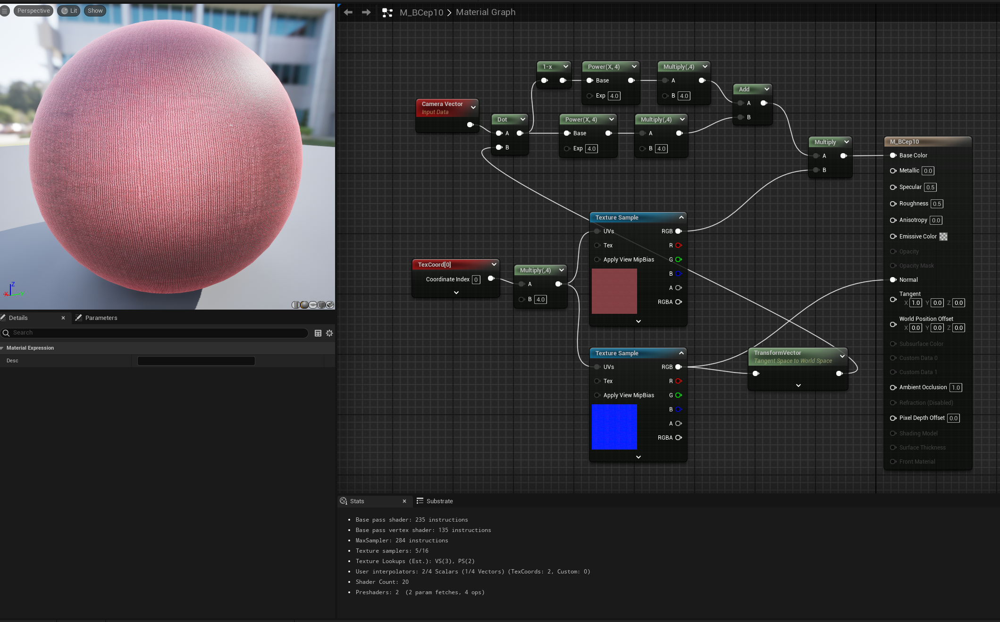

# Daily Log — 2026-06-19

**Phase:** 1 | **Month:** 2 | **Week:** 5 | **Topic:** Custom Cloth Shader Math & Material Graph Implementation in UE5

---

## 📖 Theory: How Does a Fake Cloth Shader Work?

Physically accurate cloth shading (*Physically Based Rendering* / PBR) is computationally expensive. It must simulate light scattering across millions of microscopic fabric fibers per frame. A Technical Artist is expected to build visual approximations — *cheap shaders* — that convincingly replicate this physical behavior without the GPU cost.

The technique studied today is adapted from John Hable's method for *Uncharted 2*. It uses fundamental vector mathematics — specifically a custom Fresnel approximation via the *Dot Product* function — to manipulate the final output color based on the angle between the camera direction and the surface normal. Cotton captures light at the silhouette edges (*fuzz/rim lighting*). Silk and satin capture light toward the center, or exhibit more complex specular behavior. The math encodes this distinction.

---

## 🗺️ Concept Map: Cloth Shader Formula Logic Flow (HLSL)

The mathematical logic inside this shader breaks into four sequential signal processing stages:

```
VdotN = saturate( dot( V, N ) )       →  Detect view angle against surface normal
Rim   = RimScale * pow( VdotN, RimExp )    →  Edge fiber brightness (silhouette)
Inner = InnerScale * pow( 1-VdotN, InnerExp )  →  Center brightness (camera-facing)
ClothMultiplier = Rim + Inner + Lambert    →  Combine all → multiply against albedo
```

| Stage | Expression | What It Controls |
| :--- | :--- | :--- |
| View Angle Detection | `saturate( dot( V, N ) )` | Angular relationship: camera vs. surface normal |
| Edge Lighting (Rim) | `RimScale * pow( VdotN, RimExp )` | Fine fiber brightness at silhouette |
| Center Lighting (Inner) | `InnerScale * pow( 1-VdotN, InnerExp )` | Inverse of Rim — camera-facing area |
| Final Output | `Rim + Inner + Lambert` | Combined multiplier applied to texture |

---

## 🔬 Shader Component Analysis

Each HLSL expression implemented in the material graph has a specific visual function:

| Variable / Function | Visual Role in Shader | TA Analysis |
| :--- | :--- | :--- |
| `dot( V, N )` | Computes cosine of angle between Camera (`V`) and Normal (`N`). | Returns 1 at object center (facing camera), 0 at silhouette edges. |
| `saturate()` | Clamps output strictly to 0–1 range. | Prevents negative values — eliminates color bleed and flickering. |
| `pow(..., Exp)` | Controls falloff gradient sharpness. | High Exp → narrow, sharp distribution. Low Exp → broad, soft spread. |
| `Scale` / `Multiplier` | Controls per-component brightness intensity. | Primary Scalar parameter exposed to artists for fabric type tuning. |
| `Lambert` | Provides base Lambertian diffuse. | Prevents the object from going solid black in conventionally shadowed areas. |

---

## ✅ What I Did Today

### 1. Initial Node Graph Implementation & Color Troubleshooting

- Assembled the custom Fresnel expression using `CameraVector`, `TransformVector`, `Dot`, `Power`, and `Multiply` nodes in Unreal Engine's Material Editor.
- **Problem:** Initial iteration — preview sphere rendered monochromatic (white-grey). Original red fabric color was lost entirely.
- **Root Cause:** The math output (*ClothMultiplier*) was wired directly into *Base Color*. The `Texture Sample` node (red fabric albedo) below it was not connected to the main graph path at all.

### 2. Signal Flow Correction

- Added a `Multiply` node at the end of the math chain, before the final material output.
- Connected *ClothMultiplier* output → Pin A of `Multiply`.
- Connected RGB output of the red fabric `Texture Sample` → Pin B of `Multiply`.
- Routed the product → **Base Color** pin.
- Result: material now renders red cotton fabric with correct dynamic fiber shading.

### 3. Coordinate Space Synchronization

- Converted the fabric *Normal Map* from *Tangent Space* to *World Space* using `TransformVector`.
- This is not optional. `CameraVector` operates in *World Space*. Without this alignment, `Dot Product` produces incorrect lighting calculations whenever the camera moves — the shading breaks relative to camera angle rather than surface geometry.

### 4. Lerp and Smoothstep Node Integration

- **Lerp — Fuzz Color Control:** Without Lerp, the Rim component simply brightens the base red mathematically. With a `Lerp` node, the edge fiber color becomes independently assignable. Example: green velvet fabric typically shows yellowish fiber highlights at its silhouette — this cannot be achieved with Scale alone.
- **Smoothstep — Transition Sharpness:** The Fresnel falloff from `Power` alone fades too gradually for certain fabric types. For fine fibers that should appear only at the extreme outer edge (thin satin), `Smoothstep` provides a sharper, more controllable threshold than `Power` can achieve.

---




## 🎯 TA Skills Practiced Today

| Skill | Relevance as a Technical Artist |
| :--- | :--- |
| **Optimization via Fake Shaders** | Knowing when to replace heavy PBR computation with GPU-efficient math approximations — and understanding what accuracy is traded away. |
| **Node Signal Flow Debugging** | Identifying pin mapping errors (*Base Color* losing albedo input) and resolving via *Multiply* insertion. |
| **Applied Vector Mathematics** | Using *Dot Product* in production context to detect camera viewing angle relative to surface curvature. |
| **Coordinate Space Transformation** | Converting vectors between spaces (*Tangent* → *World Space*) to ensure material calculations remain geometrically correct. |
| **Look Development & Parameterization** | Exposing *Power* and *Scale* as artist-facing parameters to produce distinct fabric variations (cotton, denim, silk) from one shader architecture. |

---

## 💡 Insights & New Understanding

- `dot( V, N )` is not an abstract math exercise. It is a camera-awareness function. The material knows where the camera is and responds to it. That is the entire mechanism behind Fresnel-based cloth shading.
- The signal flow in a UE5 Material Graph and the signal flow in a ComfyUI pipeline are the same mental model applied to different domains. Inputs feed into processing nodes and produce an output. The topology is identical.
- Fake shaders are a deliberate design decision, not a shortcut. Cloth shading in PBR requires a dedicated shading model (UE5's native *Cloth* shading model uses a modified GGX + fuzz term). The fake version traded light-dependence for view-dependence. That tradeoff is intentional and acceptable for many production contexts.
- Exposing `Power` and `Scale` as parameters is the difference between a shader and a material system. One produces a single result. The other produces a family of results from one architecture.
- `Smoothstep` and `Lerp` are control nodes, not effect nodes. They do not add visual elements — they control where and how existing elements blend. Understanding this distinction is fundamental to reading and building material graphs.

---

## 📝 Technical Artist Notes

**Fake Cloth vs. Native Cloth Shading Model — Honest Assessment**
This technique is view-dependent, not light-dependent. It responds to camera angle, not light position. UE5's native Cloth shading model handles dynamic lighting correctly because it uses a proper fuzz BRDF. The fake version does not. For static or controlled lighting environments (cutscenes, hero assets on fixed platforms), the fake shader performs excellently. For fully dynamic lighting environments, use the native model.

**Design Modularity**
The graph architecture built today is reusable without structural modification. Swapping the albedo texture and adjusting `Power`/`Scale` constants changes the material character from rough cotton to high-sheen satin. The core graph does not change. This is the same principle as a parameterized material function in UE5 — structure is fixed, inputs are variable.

**Coordinate Space Is Not Optional**
Every time a `CameraVector` or `ReflectionVector` node is used in a material graph, the Normal input must be in the same space. Tangent Space normals cannot be dot-producted against World Space vectors. The result is not just inaccurate — it is broken in motion.

---

## 🔧 Tools & Environment

- **Engine:** Unreal Engine 5 (Material Editor Graph)
- **Reference Method:** John Hable (*Uncharted 2 Cloth Approximation Technique*)

---

## 📌 Plan for Next Session

- Continue practice and experimentation 
