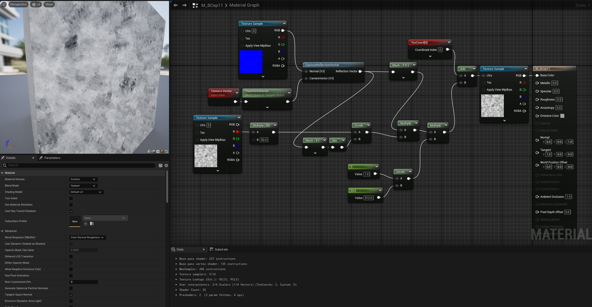

# Daily Log — 2026-06-20

**Phase:** 1 | **Month:** 2 | **Week:** 5 | **Topic:** Volumetric Ice Shader Mechanics & Parallax Mapping in UE4/UE5

---

## 📖 Theory: How Does a Volumetric Ice Shader Work?

True volumetric depth — manipulating actual geometry or vertex data to fake an internal 3D structure — is computationally wasteful for something as common as an ice block or window pane. A Technical Artist instead reaches for **Parallax Mapping** (also called *Interior Mapping*): a 2D UV-coordinate trick that shifts texture lookups based on the angle between the camera and the surface normal, convincing the eye that flat geometry contains real volume underneath it.

Where yesterday's cloth shader was about *light attenuation* (how brightness changes with view angle), this technique is about *coordinate attenuation* — the camera angle itself reshapes what UV coordinates get sampled, not how bright they appear.

---

## 🗺️ Concept Map: Volumetric Shader Formula Logic Flow (HLSL)

The internal math follows a five-stage pipeline:

```
CameraVector (World) → TransformVector (World → Tangent)
→ CustomReflectionVector( V, N ) → Invert → Transmission Vector
→ Mask(RG) * DepthControl * (1 / TextureRes) → Add to TexCoord → Offset UVs
```

| Stage | Math / Node | What It Controls |
| :--- | :--- | :--- |
| 1. Coordinate Alignment | `TransformVector (World → Tangent)` | Syncs the camera vector with surface orientation |
| 2. Vector Reflection | `CustomReflectionVector(V, N)` | Calculates the camera-view bounce against the normal |
| 3. Perspective Scale | `Divide( Depth / Abs(ReflectionVector.Z) )` | Calculates perspective attenuation |
| 4. Pixel Normalization | `Multiply( Depth * (1/TextureRes) )` | Normalizes the offset to pixel-space limits |
| 5. UV Distortion | `Add( TexCoord, Offset )` | Drives UV distortion for interior noise |

---

## 🔬 Shader Component Analysis

| Variable / Function | Visual Role in Shader | TA Analysis |
| :--- | :--- | :--- |
| `CameraVector` / `TransformVector` | Captures view direction and converts it into Tangent Space | Required for stability — keeps the math consistent with surface-local normals |
| `CustomReflectionVector` | Generates the core directional vector used to fake internal depth | Operates "above" the surface by default; inverting it produces a transmission vector instead |
| Component Mask (RG / B) | Isolates X/Y for UV shifting; `Abs(B)` derives depth | Prevents negative depth values from producing visual artifacts |
| Normal Map | Distorts the `CustomReflectionVector` | Simulates an uneven, pocked interior surface rather than a flat one |
| Noise Texture as Depth | Replaces a static scalar depth value | Forces organic, non-uniform depth variation across the surface |

---

## ✅ What I Did Today

### 1. Vector and Transform Setup

- Built `CameraVector` and `TransformVector` (World → Tangent) and fed both into `CustomReflectionVector` to compute the core directional vector for the shader.
- Kept the normal input consistently in Tangent Space, matching the same coordinate-space discipline from yesterday's cloth shader.

### 2. Parallax / Depth Control

- Initial pass used a flat scalar for depth — visually correct but uniform and artificial across the whole surface.
- Replaced the scalar with a `Texture Sample` driving Perlin noise, giving per-pixel depth variation instead of a single global value.
- **Result:** the parallax offset now reads as organic rather than mathematically "perfect."

### 3. Surface Distortion

- Swapped the flat normal input for `T_Metal_Gold_N` to warp the interior reflection vector.
- This produced a refractive, bubbly, non-uniform look more consistent with real ice than a clean parallax offset alone.

### 4. UV / Albedo Integration

- Combined the calculated UV offset with the base texture coordinates and sampled `T_Perlin_Noise_M` for the final Base Color.
- Confirmed the offset UVs were correctly driving the albedo lookup rather than just affecting depth in isolation.

---


## 🎯 TA Skills Practiced Today

| Skill | Relevance as a Technical Artist |
| :--- | :--- |
| **Volumetric Approximation** | Faking 3D depth through view-dependent UV offsets instead of geometry |
| **Math-Driven Parameters** | Driving material depth procedurally through noise textures rather than fixed scalars |
| **Refraction Simulation** | Using tangent-space normal distortion to approximate cheap surface refraction |
| **Signal Mapping** | Managing texture channels (R/G/B) to separate spatial calculations cleanly |

---

## 💡 Insights & New Understanding

- `CustomReflectionVector` operates "above" the surface by default. Inverting it is what turns a reflection calculation into a transmission vector — the conceptual key to faking volume underneath a surface rather than light bouncing off it.
- Driving depth with a noise texture instead of a scalar is the same lesson as yesterday's `Power`/`Scale` exposure: a single static value produces a single static result, while a sampled input produces a family of organic variations from the same graph.
- The core distinction from cloth shading: that technique attenuates *light* based on view angle; this technique attenuates *coordinates* based on view angle. Same camera-awareness principle, applied to a different output target.

---

## 📝 Technical Artist Notes

**Parallax Mapping vs. True Volumetric Geometry — Honest Assessment**
This technique is fundamentally a 2D trick: it never produces real depth, only a perspective-consistent illusion of it. It breaks down at extreme grazing angles or when the camera gets close enough that the lack of real parallax occlusion becomes visible. For environmental ice, glass, or window-interior assets viewed at typical gameplay distances, it is extremely cheap and convincing. For hero assets viewed in close-up or cinematics, true geometry or ray-marched volumes may be necessary.

**Coordinate Space Is Not Optional**
Same rule as yesterday: every vector feeding into this graph — `CameraVector`, normals, the reflection vector — must live in the same space (Tangent Space here) before any dot products or transforms are applied. Mixing spaces does not just produce slightly wrong results; it produces results that visibly break the moment the camera moves.

---

## 🔧 Tools & Environment

- **Engine:** Unreal Engine (Material Editor Graph)
- **Concept Reference:** Ben Cloward Volumetric Shading Mechanics (UE Materials 101) episode 11

---

