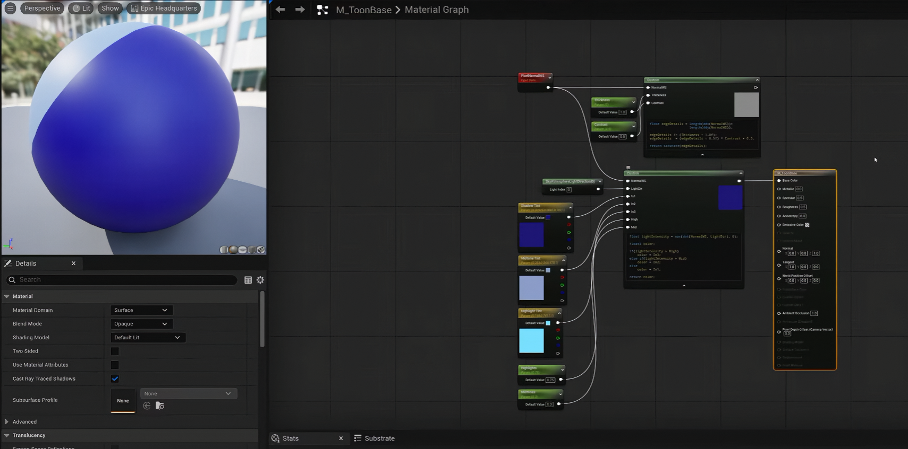
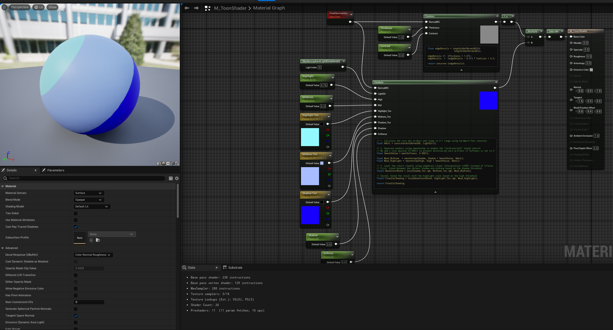
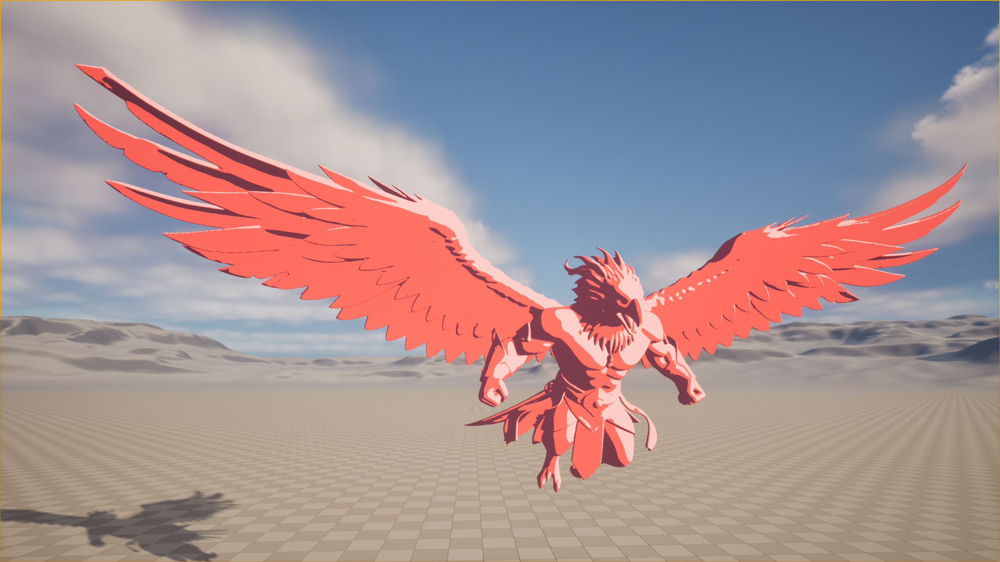

# Daily Log — 2026-06-22

**Phase:** 1 | **Month:** 2 | **Week:** 05 | **Topic:** Toon / Cel-Shading Fundamentals & Custom HLSL in UE5

---

## 📖 Theory: The Mathematics Behind Cel-Shading

Cel-shading (also called toon shading) is not about applying a cartoon texture — it is about deliberately quantizing the smooth, continuous gradient that physically-based lighting produces into a small set of discrete tonal bands, replicating the hard, deliberate shadow boundaries of hand-drawn animation.

The entire pipeline rests on a single piece of math: **Lambertian Reflectance** — the dot product between the surface normal and the incoming light direction. That scalar value, which naturally produces a smooth gradient from –1 to 1, becomes the raw input that all further toon-shading operations reshape into a cartoon aesthetic.

Where previous sessions were about simulating depth through UV coordinate manipulation (Parallax Mapping), today's session is about simulating a *drawing style* through **light quantization** — restructuring how brightness values are distributed across a surface rather than changing what geometry the camera perceives.

---

## 🗺️ Concept Map: Toon Shader Logic Flow (HLSL)

```
PixelNormalWS (N) + DirectionalLight Direction (L)
    → dot(N, L) → saturate() → NdotL [0.0 … 1.0]
        → smoothstep(Shadow, Shadow + Softness, NdotL) → Mask_Midtone
        → smoothstep(High,   High   + Softness, NdotL) → Mask_Highlight
            → lerp(Shadow_Tex, Midtone_Tex, Mask_Midtone)   → BaseColorBlend
            → lerp(BaseColorBlend, Highlight_Tex, Mask_Highlight) → FinalCelShading

PixelNormalWS → DDX / DDY → length(fwidth(NormalWS))
    → (value - Thickness) * Contrast → OutlineMask [0 … 1]
        → OneMinus → InvertedOutlineMask
            → Multiply(FinalCelShading, InvertedOutlineMask) → Base Color Pin
```

| Stage | Operation | Visual Purpose |
|---|---|---|
| 1. Light Gradient | `saturate(dot(N, L))` | Produces raw Lambertian intensity per pixel |
| 2. Tonal Bands | `smoothstep(threshold, threshold + Softness, NdotL)` | Quantizes gradient into shadow / midtone / highlight masks |
| 3. Color Blend | `lerp(A, B, Mask)` | Assigns artist-defined colors to each tonal band |
| 4. Edge Detection | `length(fwidth(NormalWS))` | Detects curvature change across screen pixels |
| 5. Outline Contrast | `(fwidth_value - Thickness) * Contrast` | Hardens curvature data into a clean binary outline |
| 6. Mask Inversion | `1.0 - OutlineMask` | Flips outline logic so edges become black, interior stays white |
| 7. Composite | `Multiply(CelColor, InvertedOutline)` | Burns the outline into the final colored surface |

---

## 🔬 Shader Component Analysis

### Custom Node 1 — Internal Outline Generator

| Variable / Function | Visual Role | TA Analysis |
|---|---|---|
| `length(fwidth(NormalWS))` | Detects rate of normal change between neighbouring pixels | Produces high values at silhouettes and curvature ridges — the geometry data that defines where outlines live |
| `value - Thickness` | Shifts the activation threshold for the outline | Increasing Thickness moves the trigger point lower, producing wider lines |
| `* Contrast` | Amplifies the gradient toward 0 or 1 | A sufficiently high Contrast value replaces the need for an explicit `step()` call — multiplication alone forces near-zero values to exactly zero and near-one values to exactly one |

> **Why no `step()` here?** The Contrast multiplication already performs the binarization. Adding `step()` on top would be a redundant instruction on the shader hardware.

---

### Custom Node 2 — Advanced Cel-Shading Engine

```hlsl
// 1. Lambertian base — clamped to [0, 1]
float NdotL = saturate(dot(NormalWS, LightDir));

// 2. Anti-zero guard — prevents GPU division-by-zero if artist sets Softness = 0
float SmoothValue = max(Softness, 0.0001);

// 3. Tonal masks via branchless smoothstep
float Mask_Midtone  = smoothstep(Shadow, Shadow + SmoothValue, NdotL);
float Mask_Highlight = smoothstep(High,   High   + SmoothValue, NdotL);

// 4. Hardware-parallel color interpolation
float3 BaseColorBlend  = lerp(Shadow_Tex.rgb,   Midtone_Tex.rgb,   Mask_Midtone);
float3 FinalCelShading = lerp(BaseColorBlend,   Highlight_Tex.rgb, Mask_Highlight);

return FinalCelShading;
```

| Code Section | Function |
|---|---|
| `saturate(dot(N, L))` | Clamps the dot product to [0, 1] using a free hardware instruction — no ALU cost |
| `max(Softness, 0.0001)` | Safety guard: guarantees `smoothstep` never receives identical edge values, which would cause undefined GPU behaviour |
| `smoothstep(edge0, edge1, x)` | Generates a smooth S-curve transition between 0 and 1 — the core quantization function |
| `lerp(A, B, t)` | Executes linear interpolation in a single clock cycle on GPU hardware; the workhorse of GPU color blending |

---

### Node 3 — OneMinus (Mask Inversion)

The outline Custom Node naturally outputs:
- Edge areas → **1** (white)
- Flat interior → **0** (black)

Multiplying cel-shading color by that raw mask would set the entire interior to black and reveal color only at the edges — the opposite of the desired result.

`OneMinus` applies `Output = 1.0 − Input`, inverting the mask:
- Edge areas → **0** (black outline)
- Flat interior → **1** (preserves full color)

When the inverted mask is multiplied against the final cel-shading color:
- Interior pixels (× 1) → color unchanged
- Edge pixels (× 0) → color collapses to pure black

This is the mathematical mechanism that "inks" the outline onto the surface.

---

## ✅ What I Did Today

### 1. Rebuilt the Lambertian Light Model from Scratch

- Connected `PixelNormalWS` and `DirectionalLight → GetDirectionalLightDirection` into a Custom HLSL node computing `saturate(dot(N, L))`.
- Observed the raw output: a smooth greyscale gradient from full shadow to full highlight — the unquantized Lambertian basis.

### 2. Replaced `if / else` Branching with `smoothstep`

- The original tutorial by renderBucket uses an `if / else` block inside HLSL to select shadow / midtone / highlight colors.
- After researching GPU architecture, I rewrote that logic using two `smoothstep` calls and two `lerp` calls — eliminating conditional branching entirely.
- Added `max(Softness, 0.0001)` as a divide-by-zero guard after identifying that passing `Softness = 0` to `smoothstep` produces undefined behaviour on some GPU vendors.
- **Result:** functionally identical visual output, but the shader now executes as pure arithmetic with no control-flow divergence.

### 3. Built the DDX / DDY Outline System

- Routed `PixelNormalWS` through `DDX` and `DDY` nodes, then summed their lengths via `length(fwidth(NormalWS))` to produce a curvature map.
- Condensed the full outline logic (`fwidth` → subtract `Thickness` → multiply `Contrast`) into a single Custom HLSL node to keep the material graph readable.
- Exposed `Thickness` and `Contrast` as Material Instance parameters for non-destructive artist iteration.

### 4. Composited the Final Material

- Applied `OneMinus` to the outline mask to invert its polarity.
- Multiplied the inverted outline against the cel-shading color output.
- Connected the result to the `Base Color` pin.
- Confirmed the final look in the viewport: solid tonal bands with clean inked edges.

---

## Screenshots

**Reference — renderBucket tutorial result:**



**My implementation — `if / else` replaced with `smoothstep`:**



**Viewport —  toon object:**




---

## 🎯 TA Skills Practiced Today

| Skill | Relevance as a Technical Artist |
|---|---|
| **Lambertian Reflectance** | Core light model underpinning virtually all diffuse shading in games |
| **Branchless Shader Logic** | Replacing `if / else` with `step` / `smoothstep` for GPU-parallel execution |
| **Edge Detection via Screen-Space Derivatives** | Using `DDX` / `DDY` to derive geometric curvature data for outlines without extra geometry passes |
| **Material Instance Parameterization** | Exposing `Thickness`, `Contrast`, `Softness`, and color slots for artist-driven iteration |
| **HLSL Custom Node Architecture** | Consolidating multi-node chains into single HLSL nodes for graph readability and compile efficiency |

---

## 💡 Insights & New Understanding

### The GPU Branching Problem

During the session I noticed the tutorial author used `if / else` inside HLSL without comment. Researching further revealed why this matters architecturally: modern GPU hardware executes thousands of pixel threads *simultaneously* in lockstep (SIMD/SIMT execution). When a conditional branch appears, the GPU cannot skip the unchosen path — it must evaluate *both* branches across the entire warp and then discard the results that did not apply. This is called **Branch Execution Penalty**, and it effectively halves throughput for the affected warps.

`step()` and `smoothstep()` are **branchless algebraic functions** — they are compiled down to a handful of multiply-add instructions with no control flow at all, which is why GPU engineers designed them as intrinsic hardware operations in the first place.

### `step` vs `smoothstep` — When to Use Which

| Function | Output Behaviour | Best Used For |
|---|---|---|
| `step(threshold, x)` | Binary: instantly 0 below threshold, 1 above | Classic hard-edged anime / old-school cel-shading |
| `smoothstep(edge0, edge1, x)` | S-curve interpolation between 0 and 1 | Soft transitions, modern anime with subtle airbrush gradients |

The `Softness` parameter in today's shader is what controls which aesthetic mode the material operates in: `Softness → 0` approaches `step` behaviour; `Softness → high` opens the transition band into a smooth gradient.

### `OneMinus` Is Not a Convenience Node — It Is Mathematics

The inversion step is not stylistic. Without it, the multiply operation produces mathematically wrong output. The correct understanding is: the outline system produces a *curvature signal*, not a *color-ready mask*. The `OneMinus` transform is the step that converts it from a signal into a usable ink mask.

### Industry Context: HLSL Code vs. Visual Node Graphs

Research into production pipelines (HoyoVerse / Genshin Impact, Arc System Works / Guilty Gear Strive) confirms that at studio scale, cel-shading is implemented entirely in handwritten HLSL rather than visual graphs, for three practical reasons:

1. **Version control** — Text files diff cleanly in Git/Perforce; node graphs do not.
2. **Cross-platform compilation** — Raw HLSL transpiles to MSL (Apple), PSSL (PlayStation), and SPIR-V (Vulkan/Android) with low friction; visual graph IR adds another conversion layer with vendor-specific edge cases.
3. **Global mutation** — A single master shader file can be modified in one place and the change propagates to every character asset simultaneously. Equivalent changes in a node graph require opening and manually editing each material.

The visual node graph in Unreal Engine is best understood as a *learning and prototyping scaffold* — it exposes the same underlying HLSL but at the cost of verbosity and reduced compile-time transparency.

### Modern Industry Extensions (2026 Landscape)

| Technique | What It Adds Over Today's Baseline |
|---|---|
| **Lumen-Isolated Cel Pass** | Extracts the directional light signal *before* Lumen composites bounce light, keeping cel-shading clean in fully dynamic GI scenes |
| **SDF Face Shading** | Replaces static face-shadow textures with a Signed Distance Field that dynamically repositions shadow under the nose and cheekbones as the light angle rotates |
| **Master Shader Cross-Platform Degradation** | A single HLSL file that automatically switches from post-process outlines (PC/PS5) to object-space `saturate`/`lerp` outlines (mobile) based on detected hardware capability |
| **In-Engine Vertex Normal Editing** | UE5 Modeling Tools now allow direct Smooth Normals / Project Normals operations inside the editor, eliminating the round-trip to Blender/Maya for cartoon-correct shading on faces |

---

## 📝 Technical Artist Notes

**Why `smoothstep` beats `step` for production character shading**
A hard `step` is visually accurate for classic 90s anime but shows aliasing artifacts along the terminator line at typical game resolutions, especially on curved surfaces. `smoothstep` with a narrow `Softness` window anti-aliases the transition implicitly by blending a sub-pixel-width gradient — a free quality gain at no extra draw call cost.

**The `max(Softness, 0.0001)` guard is not optional**
`smoothstep(a, a, x)` — where both edges are equal — is undefined behaviour in the GLSL/HLSL specification. Some GPU driver implementations clamp it silently; others return NaN, producing black pixels that are extremely difficult to diagnose. The guard eliminates this entire class of bug for the cost of a single `max` instruction.

**Object-space outlines vs. post-process outlines**
The `DDX`/`DDY` technique used today is an *object-space* outline: it reads curvature from the surface normal directly and draws edges wherever curvature is high. It is cheap and self-contained per material. The alternative — a *post-process* outline — reads the scene depth buffer after all objects are rendered and draws edges at depth discontinuities. Post-process outlines catch silhouettes between separate objects; object-space outlines only catch edges on the surface of one object. Production pipelines for anime-style games typically combine both.

---

## 🔧 Tools & Environment

- **Engine:** Unreal Engine 5.4 (Material Editor + Custom HLSL Node)
- **Reference Tutorial:** *Unreal Engine 5.5 — Simple & Easy Toon/Comic/Cel Shading* by renderBucket (YouTube)
- **Key HLSL Intrinsics Used:** `dot`, `saturate`, `smoothstep`, `lerp`, `fwidth` (`DDX` + `DDY`), `length`, `max`
